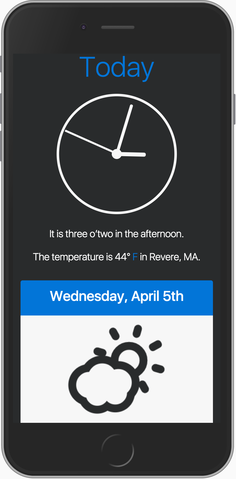

# Local Weather App

A responsive weather app using GPS and IP-based geolocation.

### Live Demo

[index.html](https://adamelliotfields.github.io/local-weather-app/index.html)

### Libraries
[Bootstrap](https://v4-alpha.getbootstrap.com/)  
[Zepto](http://zeptojs.com/)  
[Moment](https://momentjs.com/)  
[Skycons](http://darkskyapp.github.io/skycons/)

### APIs:
[Dark Sky](https://darksky.net/dev/)  
[Info IP](https://infoip.io/)  
[Google Geocoding](https://developers.google.com/maps/documentation/geocoding/start)

### Notes :sun_with_face:

*This is a clone of [adamelliotfields/free-code-camp/front-end-development/5-local-weather](https://github.com/adamelliotfields/free-code-camp/tree/master/front-end-development/5-local-weather).*

*This app was coded from scratch, start-to-finish, and was not based off of any tutorial.*

For this project, I originally went with the [Apixu](https://www.apixu.com/) API as a one-size-fits-all solution. It can take coordinates or an IP address in the query string (no need to use `navigator.geolocation.getCurrentPosition()`), and also returns the city name, weather conditions, and icons in the response.

This was all well and good for fulfilling the requirements of the project, but there were a few shortcomings. The weather data was pretty inaccurate, and the icons were very low resolution PNGs.

I decided to switch things up and use the Dark Sky API (which powers the [Forecast Bar](http://forecastbar.com/) iOS and macOS apps). As a bonus, the API response includes icon names which can easily be used with the Skycons library to display relevant animated weather icons. The Dark Sky API only takes coordinates in the query string, which requires using the browser's `getCurrentPosition()` method. Unfortunately, `getCurrentPosition()` can take a while, and some users may not be able to use it.

As a fallback, the Info IP API provides free IP-based lookups and returns coordinates in the response that can be passed along to Dark Sky. This API is only called if `getCurrentPosition()` times out after 10 seconds, or if the `getCurrentPosition()` method isn't available at all.

Since Dark Sky does not return location information, the Google Geocoding API can take coordinates and return all sorts of location data which can be parsed and displayed.

For DOM manipulation and AJAX calls, I'm using the Zepto library as a light-weight alternative to jQuery. Dates and times are from Moment.

The UI is built with Bootstrap, but instead of using the Card component, I've created my own with a couple media queries which doesn't have any nasty side effects when the resolution changes.
